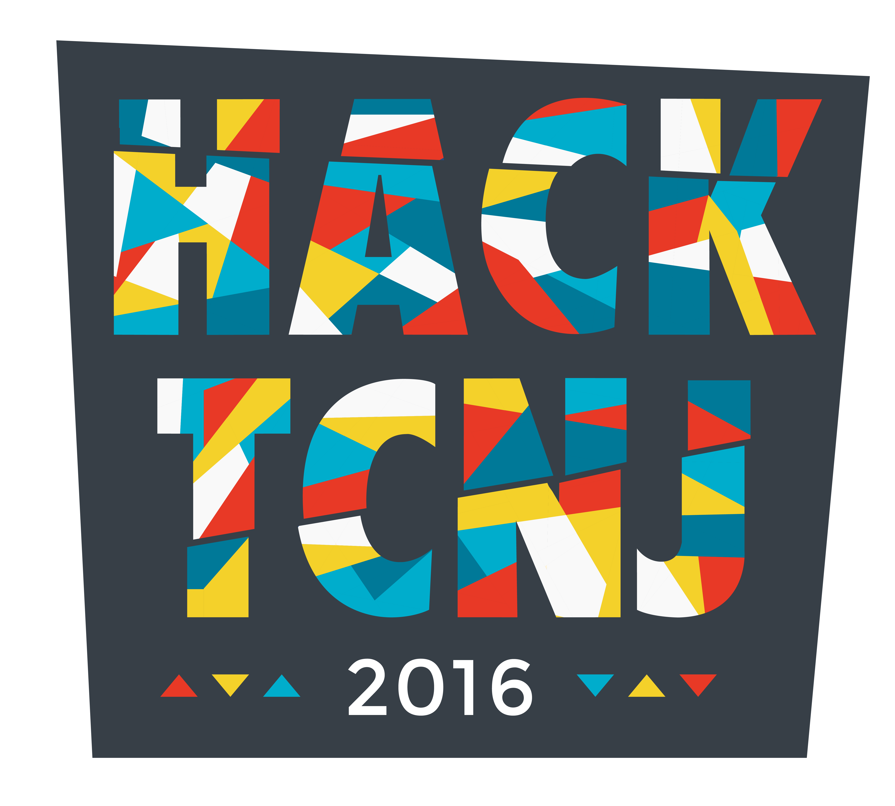

HackTCNJ 2016 Site
==================

Our beautiful 2016 logo, designed by [@kerrinrin](https://twitter.com/kerrinrin)

We wanted to make a nice site for hackers to register on.

**It also has a really nice system for organizers to work with MyMLH, this is what we would really love for others to build upon!**
*(We know, php isn't the coolest hacker language, but it works!)*

Design Requirements:
--------------------

-   Automatic Waitlist Management
-   MyMLH Integration
-   TCNJ Authentication
-   Resume Collection
-   Mailchimp Integration
-   Ability for Organizers to Manage Hackers (View Hacker Info, Check In, Drop Application, Toggle Admin, Toggle Waitlist)
-   Check In
-   Hacker Self Service ('Day Of' Dashboard, Update Info, Drop Application, Contact, View Past Emails)
-   Organizer Notifications via Slack (Error Reports, Metrics)

Setup:
------

Database Setup

    create table hackers (
        id int not null auto_increment,
        mlh_id int not null,
        checked_in boolean not null,
        website varchar(255),
        linkedin varchar(255),
        github varchar(255),
        minor boolean not null,
        waitlisted boolean not null,
        admin boolean not null,
        primary key (id)
    )

Automatic Waitlist Management Cron Setup

    php ~/www/cron_checkwaitlist.php

Dependencies:
-------------

-   MailChimp API
-   Sweetalert
